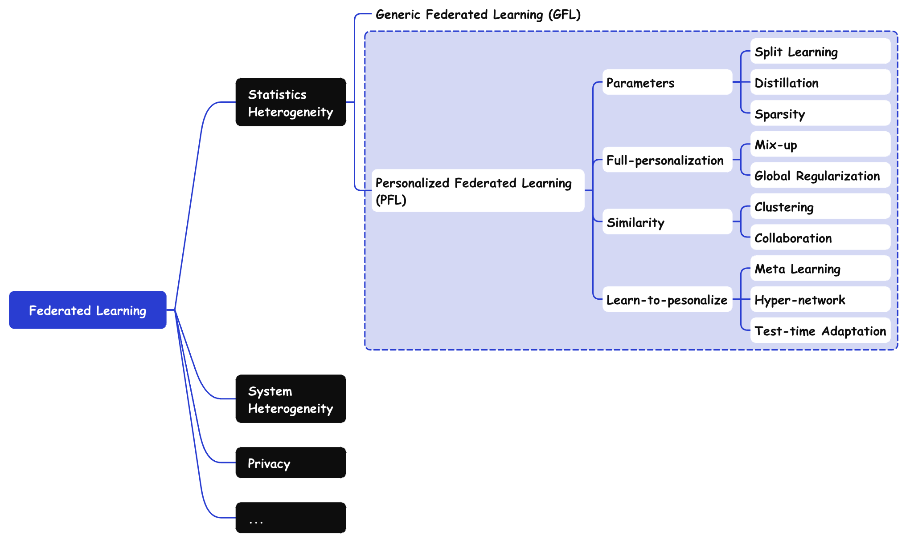

# Awesome-Personalized-Federated-Learning

Paper List for Personalized Federated Learning (PFL)

Personalized Federated Learning (PFL), allowing different parameters among clients, is designed for data heterogeneity (statistics heterogeneity) problem in federated learning.

We categorized PFL algorithms into four types and collected corresponding papers

+ **Parameters-based**: These algorithms emphasize personalization through their model parameters, enabling the customization of parameters within specific parts of the model.
+ **Full-personalization-based**: These algorithms tailor a personalized model for each client. The global information is injected via techniques like mix-up or global regularization.
+ **Similarity-based**: These algorithms focus on capturing the similarities among clients and aim to facilitate synergy between similar clients.
+ **Learn-to-personalize-based**: These algorithms are designed to identify methods for easily personalizing models locally.

A detailed mindmap of paper collected is illustrated as follow

We also collect PFL papers like

+ Per-instance PFL
+ PFL with Transformers
+ Out-of-distribution (OOD) in PFL

**More items will be added to the repository**. Please feel free to suggest other key resources by opening an issue report, submitting a pull request, or dropping me an email @ (boyliu@buaa.edu.cn). 🥳

<!-- main-start -->

## 0. Survey & Benchmark
### Survey & Benchmark
| Title | Abbreviation | Venue | Year | Materials |
|----------|----|----|----|----|
| PFLlib: Personalized Federated Learning Algorithm Library | PFLlib | arXiv | 2023 | [[PDF](https://arxiv.org/pdf/2312.04992)] [[CODE](https://github.com/TsingZ0/PFLlib)] |
| Towards Personalized Federated Learning | N/A | TNNLS | 2022 | [[PDF](https://arxiv.org/pdf/2103.00710)] |
| pFL-Bench: A Comprehensive Benchmark for Personalized Federated Learning | pFL-Bench | NIPS | 2022 | [[PDF](https://proceedings.neurips.cc/paper_files/paper/2022/file/3cc03e19fed71a2b9347d83921ca2e7d-Paper-Datasets_and_Benchmarks.pdf)] [[CODE](https://github.com/alibaba/FederatedScope/tree/master/benchmark/pFL-Bench)] |
| Motley: Benchmarking heterogeneity and personalization in federated learning | Motley | arXiv | 2022 | [[PDF](https://arxiv.org/pdf/2206.09262)] [[CODE](https://github.com/google-research/federated/tree/master/personalization_benchmark)] |
| Federated Machine Learning: Concept and Applications | N/A | TIST | 2019 | [[PAGE](https://dl.acm.org/doi/abs/10.1145/3298981)] |

## 1. Parameters
### Split Learning
| Title | Abbreviation | Venue | Year | Materials |
|----------|----|----|----|----|
| Improving Global Generalization and Local Personalization for Federated Learning | pFedCSPC | TNNLS | 2024 | [[PAGE](https://ieeexplore.ieee.org/abstract/document/10605121)] |
| Test-Time Robust Personalization for Federated Learning | FedTHE | ICLR | 2023 | [[PDF](https://arxiv.org/pdf/2205.10920)] [[CODE](https://github.com/LINs-lab/FedTHE)] |
| Personalized Federated Learning with Feature Alignment and Classifier Collaboration | FedPAC | ICLR | 2023 | [[PDF](https://arxiv.org/pdf/2306.11867)] [[CODE](https://github.com/JianXu95/FedPAC)] |
| FedCP: Separating Feature Information for Personalized Federated Learning via Conditional Policy | FedCP | KDD | 2023 | [[PAGE](https://dl.acm.org/doi/abs/10.1145/3580305.3599345)] [[CODE](https://github.com/TsingZ0/PFLlib)] |
| On bridging generic and personalized federated learning for image classification | FedRoD | ICLR | 2022 | [[PDF](https://arxiv.org/pdf/2107.00778)] [[CODE](https://github.com/hongyouc/Fed-RoD)] |
| Fedbabu: Towards enhanced representation for federated image classification | Fedbabu | ICLR | 2022 | [[PDF](https://arxiv.org/pdf/2106.06042)] [[CODE](https://github.com/jhoon-oh/FedBABU)] |
| Exploiting shared representations for personalized federated learning | FedRep | ICML | 2021 | [[PDF](https://proceedings.mlr.press/v139/collins21a/collins21a.pdf)] [[CODE](https://github.com/AC-Amiya233/FedRep)] |
| Adapt to Adaptation: Learning Personalization for Cross-Silo Federated Learning | APPLE | IJCAI | 2021 | [[PDF](https://www.ijcai.org/proceedings/2022/0301.pdf)] [[CODE](https://github.com/ljaiverson/pFL-APPLE)] |
| Think locally, act globally: Federated learning with local and global representations | LG-FedAvg | arXiv | 2020 | [[PDF](https://arxiv.org/pdf/2001.01523)] [[CODE](https://github.com/pliang279/LG-FedAvg)] |
| Federated Learning with Personalization Layers | FedPer | arXiv | 2019 | [[PDF](https://arxiv.org/pdf/1912.00818)] [[CODE](https://github.com/ki-ljl/FedPer)] |

### Distillation
| Title | Abbreviation | Venue | Year | Materials |
|----------|----|----|----|----|
| Spectral Co-Distillation for Personalized Federated Learning | PFL+ | NIPS | 2023 | [[PDF](https://proceedings.neurips.cc/paper_files/paper/2023/file/1b86cf4b15cd83b6520d851eb7298228-Paper-Conference.pdf)] |
| Cd2-pfed: Cyclic distillation-guided channel decoupling for model personalization in federated learning | CD2-pFed | CVPR | 2022 | [[PDF](https://openaccess.thecvf.com/content/CVPR2022/papers/Shen_CD2-pFed_Cyclic_Distillation-Guided_Channel_Decoupling_for_Model_Personalization_in_Federated_CVPR_2022_paper.pdf)] |
| Quped: Quantized personalization via distillation with applications to federated learning | QuPeD | NIPS | 2021 | [[PDF](https://proceedings.neurips.cc/paper/2021/file/1dba3025b159cd9354da65e2d0436a31-Paper.pdf)] |
| Data-Free Knowledge Distillation for Heterogeneous Federated Learning | FedGEN | ICML | 2021 | [[PDF](https://proceedings.mlr.press/v139/zhu21b/zhu21b.pdf)] |
| Federated model distillation with noise-free differential privacy | FedMD-NFDP | IJCAI | 2021 | [[PDF](https://www.ijcai.org/proceedings/2021/0216.pdf)] |
| Parameterized Knowledge Transfer for Personalized Federated Learning | KT-pFL | NIPS | 2021 | [[PDF](https://proceedings.neurips.cc/paper_files/paper/2021/file/5383c7318a3158b9bc261d0b6996f7c2-Paper.pdf)] |
| Ensemble distillation for robust model fusion in federated learning | FedDF | NIPS | 2020 | [[PDF](https://proceedings.neurips.cc/paper/2020/file/18df51b97ccd68128e994804f3eccc87-Paper.pdf)] |
| Fedmd: Heterogenous federated learning via model distillation | FedMD | arXiv | 2019 | [[PDF](https://arxiv.org/pdf/1910.03581)] |
| Communication-efficient on-device machine learning: Federated distillation and augmentation under non-iid private data | FD | arXiv | 2018 | [[PDF](https://arxiv.org/pdf/1811.11479)] |

### Sparsity
| Title | Abbreviation | Venue | Year | Materials |
|----------|----|----|----|----|
| FedP3: Federated Personalized and Privacy-friendly Network Pruning under Model Heterogeneity | FedP3 | ICLR | 2024 | [[PDF](https://arxiv.org/pdf/2404.09816)] |
| DM-PFL: Hitchhiking Generic Federated Learning for Efficient Shift-Robust Personalization | DM-PFL | KDD | 2023 | [[PAGE](https://dl.acm.org/doi/abs/10.1145/3580305.3599311)] |
| Efficient Personalized Federated Learning via Sparse Model-Adaptation | pFedGate | ICML | 2023 | [[PDF](https://proceedings.mlr.press/v202/chen23aj/chen23aj.pdf)] [[CODE](https://github.com/alibaba/FederatedScope/tree/master/benchmark/pFL-Bench)] |
| PerFedMask: Personalized federated learning with optimized masking vectors | PerFedMask | ICLR | 2023 | [[PDF](https://openreview.net/pdf?id=hxEIgUXLFF)] [[CODE](https://github.com/MehdiSet/PerFedMask)] |
| Personalized Subgraph Federated Learning | FED-PUB | ICML | 2023 | [[PDF](https://proceedings.mlr.press/v202/baek23a/baek23a.pdf)] [[CODE](https://github.com/JinheonBaek/FED-PUB)] |
| Dynamic Personalized Federated Learning with Adaptive Differential Privacy | FedDPA | NIPS | 2023 | [[PDF](https://proceedings.neurips.cc/paper_files/paper/2023/file/e4724af0e2a0d52ce5a0a4e084b87f59-Paper-Conference.pdf)] [[CODE](https://github.com/xiyuanyang45/DynamicPFL)] |
| DisPFL: Towards Communication-Efficient Personalized Federated Learning via Decentralized Sparse Training | DisPFL | ICML | 2022 | [[PAGE](https://proceedings.mlr.press/v162/dai22b)] [[CODE](https://github.com/rong-dai/DisPFL)] |
| Tailorfl: Dual-personalized federated learning under system and data heterogeneity | TailorFL | SenSys | 2022 | [[PDF](https://dl.acm.org/doi/pdf/10.1145/3560905.3568503)] |
| FedMask: Joint Computation and Communication-Efficient Personalized Federated Learning via Heterogeneous Masking | FedMask | SenSys | 2021 | [[PDF](https://dl.acm.org/doi/pdf/10.1145/3485730.3485929)] |
| Hermes: an efficient federated learning framework for heterogeneous mobile clients | Hermes | MobiCom | 2021 | [[PAGE](https://dl.acm.org/doi/abs/10.1145/3447993.3483278)] |

## 2. Full-Personalization
### Mix-up
| Title | Abbreviation | Venue | Year | Materials |
|----------|----|----|----|----|
| Heterogeneous Personalized Federated Learning by Local-Global Updates Mixing via Convergence Rate | LG-Mix | ICLR | 2024 | [[PDF](https://openreview.net/pdf?id=7pWRLDBAtc)] [[CODE](https://github.com/med-air/HeteroPFL)] |
| FedALA: Adaptive Local Aggregation for Personalized Federated Learning | FedALA | AAAI | 2023 | [[PAGE](https://ojs.aaai.org/index.php/AAAI/article/view/26330)] [[CODE](https://github.com/TsingZ0/PFLlib)] |
| Adaptive personalized federated learning | APFL | arXiv | 2020 | [[PDF](https://arxiv.org/pdf/2003.13461)] |

### Global Regularization
| Title | Abbreviation | Venue | Year | Materials |
|----------|----|----|----|----|
| Ditto: Fair and Robust Federated Learning Through Personalization | Ditto | ICML | 2021 | [[PDF](https://proceedings.mlr.press/v139/li21h/li21h.pdf)] [[CODE](https://github.com/litian96/ditto)] |
| Personalized federated learning with moreau envelopes | pFedMe | NIPS | 2020 | [[PDF](https://proceedings.neurips.cc/paper/2020/file/f4f1f13c8289ac1b1ee0ff176b56fc60-Paper.pdf)] [[CODE](https://github.com/CharlieDinh/pFedMe)] |

## 3. Similarity
### Clustering
| Title | Abbreviation | Venue | Year | Materials |
|----------|----|----|----|----|
| CASA: Clsutered Federated Learning for Asynchronous Clients | CASA | KDD | 2024 | |
| EchoPFL: Asynchronous Personalized Federated Learning on Mobile Devices with On-Demand Staleness Control | EchoPFL | UbiComp | 2024 | [[PAGE](https://dl.acm.org/doi/abs/10.1145/3643560)] [[PDF](https://arxiv.org/pdf/2401.15960)] |
| Exploiting Label Skews in Federated Learning with Model Concatenation | FedConcat | AAAI | 2024 | [[PAGE](https://ojs.aaai.org/index.php/AAAI/article/view/29063)] |
| Adaptive Group Personalization for Federated Mutual Transfer Learning | AdaGrp | ICML | 2024 | |
| Clustered Federated Learning via Gradient Partitioning | N/A | ICML | 2024 | |
| FedRC: Tackling Diverse Distribution Shifts Challenge in Federated Learning by Robust Clustering | FedRC | ICML | 2024 | |
| Clustered Federated Learning in Heterogeneous Environment | ICFL | TNNLS | 2023 | [[PAGE](https://ieeexplore.ieee.org/abstract/document/10106044/)] |
| Auxo: Efficient Federated Learning via Scalable Client Clustering | Auxo | SoCC | 2023 | [[PAGE](https://dl.acm.org/doi/abs/10.1145/3620678.3624651)] [[PDF](https://arxiv.org/pdf/2210.16656)] |
| Multi-center federated learning: clients clustering for better personalization | FeSEM | WWW | 2023 | [[PAGE](https://link.springer.com/article/10.1007/s11280-022-01046-x)] |
| ClusterFL: A Similarity-Aware Federated Learning Systemfor Human Activity Recognition | ClusterFL | MobiSys | 2021 | [[PAGE](https://dl.acm.org/doi/abs/10.1145/3458864.3467681)] [[CODE](https://github.com/xmouyang/ClusterFL)] |
| DistFL: Distribution-aware Federated Learning for Mobile Scenarios | DistFL | UbiComp | 2021 | [[PAGE](https://dl.acm.org/doi/abs/10.1145/3494966)] [[PDF](https://arxiv.org/pdf/2110.11619)] |
| Clustered Federated Learning: Model-Agnostic Distributed Multitask Optimization Under Privacy Constraints | CFL | TNNLS | 2020 | [[PDF](https://ieeexplore.ieee.org/stamp/stamp.jsp?arnumber=9174890)] [[CODE](https://github.com/felisat/clustered-federated-learning)] |
| An Efficient Framework for Clustered Federated Learning | IFCA | NIPS | 2020 | [[PDF](https://proceedings.neurips.cc/paper_files/paper/2020/file/e32cc80bf07915058ce90722ee17bb71-Paper.pdf)] [[CODE](https://github.com/jichan3751/ifca)] |
| Federated learning with hierarchical clustering of local updates to improve training on non-IID data | FL+HC | IJCNN | 2020 | [[PAGE](https://ieeexplore.ieee.org/abstract/document/9207469)] [[PDF](https://arxiv.org/pdf/2004.11791)] |

### Collaboration
| Title | Abbreviation | Venue | Year | Materials |
|----------|----|----|----|----|
| Rethinking Personalized Client Collaboration in Federated Learning | pFedSV | TMC | 2024 | [[PAGE](https://ieeexplore.ieee.org/abstract/document/10517642)] |
| Personalized Federated Learning with Inferred Collaboration Graphs | pFedGraph | ICML | 2023 | [[PDF](https://proceedings.mlr.press/v202/ye23b/ye23b.pdf)] [[CODE](https://github.com/MediaBrain-SJTU/pFedGraph)] |
| Personalized Federated Learning with Feature Alignment and Classifier Collaboration | FedPAC | ICLR | 2023 | [[PDF](https://arxiv.org/pdf/2306.11867)] [[CODE](https://github.com/JianXu95/FedPAC)] |
| Personalized Cross-Silo Federated Learning on Non-IID Data | FedAMP | AAAI | 2021 | [[PDF](https://ojs.aaai.org/index.php/AAAI/article/view/16960)] |
| Variational federated multi-task learning | VIRTUAL | arXiv | 2019 | [[PDF](https://arxiv.org/pdf/1906.06268)] |
| Federated Multi-Task Learning | MOCHA | NIPS | 2017 | [[PDF](https://proceedings.neurips.cc/paper/2017/file/6211080fa89981f66b1a0c9d55c61d0f-Paper.pdf)] [[CODE](https://github.com/gingsmith/fmtl)] |

## 4. Learn to Personalize
### Meta Learning
| Title | Abbreviation | Venue | Year | Materials |
|----------|----|----|----|----|
| Personalized Federated Learning with Parameter Propagation | FEDORA | KDD | 2023 | [[PAGE](https://dl.acm.org/doi/abs/10.1145/3580305.3599464)] |
| FedL2P: Federated Learning to Personalize | FedL2P | NIPS | 2023 | [[PDF](https://proceedings.neurips.cc/paper_files/paper/2023/file/2fb57276bfbaf1b832d7bfcba36bb41c-Paper-Conference.pdf)] [[CODE](https://github.com/royson/fedl2p)] |
| Personalized Federated Learning with Theoretical Guarantees: A Model-Agnostic Meta-Learning Approach | Per-FedAvg | NIPS | 2020 | [[PDF](https://proceedings.neurips.cc/paper/2020/file/24389bfe4fe2eba8bf9aa9203a44cdad-Paper.pdf)] |
| Improving federated learning personalization via model agnostic meta learning | MAML | arXiv | 2019 | [[PDF](https://arxiv.org/pdf/1909.12488)] |

### Hyper-network
| Title | Abbreviation | Venue | Year | Materials |
|----------|----|----|----|----|
| FedMBridge: Bridgeable Multimodal Federated Learning | FedMBridge | ICML | 2024 | [[PDF](https://openreview.net/pdf?id=jrHUbftLd6)] |
| PeFLL: Personalized Federated Learning by Learning to Learn | PeFLL | ICLR | 2023 | [[PDF](https://openreview.net/pdf?id=MrYiwlDRQO)] |
| Personalized federated learning using hypernetworks | pFedHN | ICML | 2021 | [[PDF](https://proceedings.mlr.press/v139/shamsian21a/shamsian21a.pdf)] [[CODE](https://github.com/AvivSham/pFedHN)] |

### Test-time Adaptation
| Title | Abbreviation | Venue | Year | Materials |
|----------|----|----|----|----|
| Adaptive Test-Time Personalization for Federated Learning | ATP | NIPS | 2023 | [[PDF](https://proceedings.neurips.cc/paper_files/paper/2023/file/f555b62384279b98732204cb1a670a23-Paper-Conference.pdf)] [[CODE](https://github.com/baowenxuan/ATP)] |

## 5. Other
### Per-instance PFL
| Title | Abbreviation | Venue | Year | Materials |
|----------|----|----|----|----|
| Flow: Per-instance Personalized Federated Learning | Flow | NIPS | 2023 | [[PDF](https://proceedings.neurips.cc/paper_files/paper/2023/file/3baf4eeffad860ca9c54aeab632716b4-Paper-Conference.pdf)] [[CODE](https://github.com/Astuary/Flow)] |
| FedCP: Separating Feature Information for Personalized Federated Learning via Conditional Policy | FedCP | KDD | 2023 | [[PAGE](https://dl.acm.org/doi/abs/10.1145/3580305.3599345)] [[CODE](https://github.com/TsingZ0/PFLlib)] |
| Personalized Federated Learning through Local Memorization | KNN-Per | ICML | 2022 | [[PDF](https://proceedings.mlr.press/v162/marfoq22a/marfoq22a.pdf)] [[CODE](https://github.com/omarfoq/knn-per)] |

### PFL in Transformers
| Title | Abbreviation | Venue | Year | Materials |
|----------|----|----|----|----|
| FedPerfix: Towards Partial Model Personalization of Vision Transformers in Federated Learning | FedPerfix | ICCV | 2023 | [[PDF](https://openaccess.thecvf.com/content/ICCV2023/papers/Sun_FedPerfix_Towards_Partial_Model_Personalization_of_Vision_Transformers_in_Federated_ICCV_2023_paper.pdf)] [[CODE](https://github.com/imguangyu/FedPerfix)] |
| FedTP: Federated Learning by Transformer Personalization | FedTP | TNNLS | 2023 | [[PAGE](https://ieeexplore.ieee.org/abstract/document/10130784)] [[PDF](https://arxiv.org/pdf/2211.01572)] |
| Efficient Model Personalization in Federated Learning via Client-Specific Prompt Generation | pFedPG | ICCV | 2023 | [[PDF](https://openaccess.thecvf.com/content/ICCV2023/papers/Yang_Efficient_Model_Personalization_in_Federated_Learning_via_Client-Specific_Prompt_Generation_ICCV_2023_paper.pdf)] |

### Out-of-distribution/Generalization in PFL
| Title | Abbreviation | Venue | Year | Materials |
|----------|----|----|----|----|
| Learning Personalized Causally Invariant Representations for Heterogeneous Federated Clients | FedSDR | ICLR | 2024 | [[PDF](https://openreview.net/pdf?id=8FHWkY0SwF)] [[CODE](https://github.com/Tangx-yy/FedSDR)] |
| Improving Global Generalization and Local Personalization for Federated Learning | pFedCSPC | TNNLS | 2024 | [[PAGE](https://ieeexplore.ieee.org/abstract/document/10605121)] |
| Test-Time Robust Personalization for Federated Learning | FedTHE | ICLR | 2023 | [[PDF](https://arxiv.org/pdf/2205.10920)] [[CODE](https://github.com/LINs-lab/FedTHE)] |
| DM-PFL: Hitchhiking Generic Federated Learning for Efficient Shift-Robust Personalization | DM-PFL | KDD | 2023 | [[PAGE](https://dl.acm.org/doi/abs/10.1145/3580305.3599311)] |
| On bridging generic and personalized federated learning for image classification | FedRoD | ICLR | 2022 | [[PDF](https://arxiv.org/pdf/2107.00778)] [[CODE](https://github.com/hongyouc/Fed-RoD)] |

<!-- main-end -->

 <!-- update-time-start -->

**Last Update: Jul 23, 2024 22:37:28**

<!-- update-time-end -->

